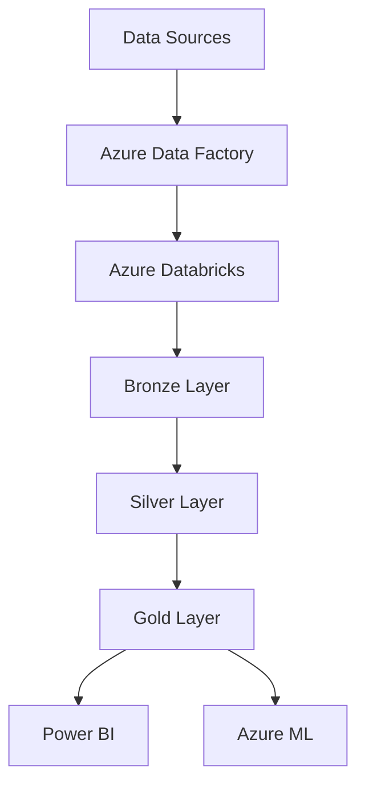

# KYC Risk Project

[](https://www.python.org/downloads/)
[](https://spark.apache.org/docs/latest/api/python/)
[](https://azure.microsoft.com/)
[](https://databricks.com/)

This project aims to build a modular and scalable data pipeline for KYC (Know Your Customer) risk analysis, using modern data engineering tools such as Python, PySpark, and full integration with Azure Cloud services and Power BI for analytics.

## 📁 Project Structure

```
kyc_risk_project-main/
│
├── README.md                          # Main project description
│
├── docs/                              # Project documentation
│   ├── 01_documetation_kyc.md
│   ├── fluxo_azure_ready.png
│   └── er_diagram.jpg
│
├── notebooks/                         # Databricks notebooks for each pipeline stage
│   ├── 01_ingestion_raw_data.ipynb
│   ├── 02_processing_silver.ipynb
│   └── 03_processing_gold.ipynb
│
└── scripts/                           # Python modules for CLI-based pipeline execution
    ├── 00_ingestion.py
    ├── 01_utils.py
    ├── 02_processing.py
    └── 03_orchestration.py
```

## ✨ Current Features

- 📊 **Data Ingestion**: Ingestion of simulated KYC data from structured CSVs
- 🎯 **Risk Classification**: Pipeline using business rules for risk assessment
- 🔍 **Data Quality**: Comprehensive checks and transformation layers (Bronze, Silver, Gold)
- 🏗️ **Modular Architecture**: Enables orchestration through notebooks or CLI
- 📈 **Visual Documentation**: ER diagram and Azure architecture draft included

## 🚀 Usage

The pipeline was designed to be executed in:

### 1. CLI Execution
Using the modular Python scripts directly:

```bash
# Install dependencies
pip install -r requirements.txt

```

### 2. Azure Databricks (Orchestration)
Through Databricks workflow, which runs the Databricks notebooks as pipeline activities.

> **Note**: The `requirements.txt` file should be generated once dependencies are finalized.

## 🛠️ Technology Stack

- **Data Processing**: PySpark, Python
- **Cloud Platform**: Microsoft Azure
- **Data Storage**: Azure Data Lake Storage, Delta Lake
- **Compute**: Azure Databricks
- **Orchestration**: Azure Data Factory
- **Analytics**: Power BI
- **Version Control**: Git, GitHub

## 🔮 Future Improvements

To enhance automation, scalability, and AI-driven decision-making, future iterations will include:

- 🔄 **CI/CD Pipeline**: Deployment via GitHub Actions to Azure
- ☁️ **Full Azure Integration**: Complete orchestration between Data Factory, Databricks, and Azure Storage
- 🤖 **ML-based Risk Scoring**: Using Azure Machine Learning for advanced analytics
- 📊 **Monitoring & Logging**: Azure Monitor and Log Analytics integration
- 🔐 **Security**: Secrets and environment config management via Azure Key Vault
- 🧪 **Testing**: Automated testing and data validation frameworks

## 📚 Documentation

All relevant diagrams and documentation are available in the `docs/` folder:

- 📋 **KYC Documentation**: Project overview
- 🗺️ **ER Diagram**: Database schema and relationships
- 🏗️ **Azure Flow Design**: Cloud architecture blueprint

## 🏗️ Architecture Overview



## 🤝 Contributing

1. Fork the repository
2. Create a feature branch (`git checkout -b feature/**`)
3. Commit your changes (`git commit -m 'Add feature'`)
4. Push to the branch (`git push origin feature/***`)
5. Open a Pull Request


## 👩‍💻 Author

**Julia Bento**

- GitHub: [@juliabento](https://github.com/juliabento)
- LinkedIn: [Julia Bento](https://linkedin.com/in/julia-soares-bento)

---

⭐ **Star this repository if you find it helpful!**
